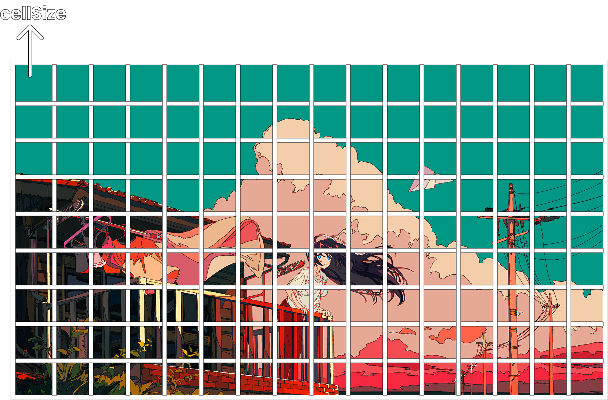

# ascii-art-generator
Generate ASCII art from Images [here](https://github.com/saga2405/ascii-art-generator.git).

## How to use?
1) Navigate to https://github.com/saga2405/ascii-art-generator.git
2) Select an Image from your local system, which you want to convert in ASCII art. 
3) Specify the resolution of the genreated art, default resolution being 1.

## How to use? (On Localhost)
1) Open your termianal and clone this [repository](https://github.com/saga2405/ascii-art-generator.git) using ```git clone https://github.com/saga2405/ascii-art-generator.git```
2) Then naviagte to the directory where you have cloned this repository using ```cd ascii-art-generator``` and open your code editor in that directory.
3) Now, you should have [Live Server](https://marketplace.visualstudio.com/items?itemName=ritwickdey.LiveServer) extension installed if you are usign VS Code.
4) Navigate to `index.html` in your code editor, right click and select `Open with Live Server`, and now you can interact with ASCII art generator as specified above.

## How it works?
First the user is asked to upload the image, that they want to convert into ASCII art: <br />
<p align="center">
  
</p>

Let's say the user selected the following image: <br />
<p align="center">
   
</p>

Now, after the image has been uploaded, an array is created on the top of the image and the cell size of the array is specified by the user, then for every cell average color of the part of image present in that cell is calculated, and finally each cell is being replaced by an ASCII character based on the average color, also the color of every portion of image in a cell is noted, and that color is given to the final character present in that cell.
> **NOTE:** If the average color is too less (in this project <20) then an empty string is being replaced instead of an ASCII character. 
<p align="center">
   
</p>
The user can change the number of cells using the slider at the bottom of the uploaded image (by default the slider value 1 represents the original image, it can be controlled using both cursor movement and arrow keys). <br /> <br />
<p align="center">
   
</p>

### Here is the complete Demo:
<p align="center">
   
</p>